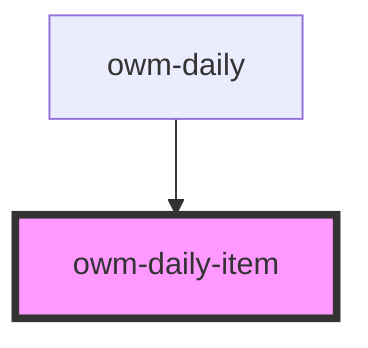

# owm-daily-item

<!-- Auto Generated Below -->

## Properties

| Property   | Attribute | Description | Type       | Default                                                                                                            |
| ---------- | --------- | ----------- | ---------- | ------------------------------------------------------------------------------------------------------------------ |
| `day`      | `day`     |             | `any`      | `undefined`                                                                                                        |
| `seq`      | `seq`     |             | `number`   | `0`                                                                                                                |
| `weekDays` | --        |             | `string[]` | `[         'SUN',         'MON',         'TUE',         'WED',         'THU',         'FRI',         'SAT',     ]` |

## Dependencies

### Used by

 - [owm-daily](.)

### Graph

----------------------------------------------

*Built with [StencilJS](https://stenciljs.com/)*
