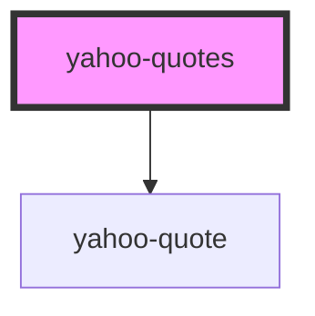

# yahoo-quotes

<!-- Auto Generated Below -->

## Properties

| Property                   | Attribute      | Description     | Type                  | Default          |
| -------------------------- | -------------- | --------------- | --------------------- | ---------------- |
| `connection` _(required)_  | --             | Prop            | `WebsocketConnection` | `undefined`      |
| `dataChannel` _(required)_ | `data-channel` | Prop            | `string`              | `undefined`      |
| `dataKey`                  | `data-key`     | Prop (optional) | `string`              | `undefined`      |
| `debug`                    | `debug`        |                 | `boolean`             | `false`          |
| `namespace`                | `namespace`    | Prop (optional) | `string`              | `'yahoo-quotes'` |
| `useCache`                 | `use-cache`    | Prop            | `boolean`             | `true`           |

## Methods

### `log(...args: any[]) => Promise<void>`

Method

#### Returns

Type: `Promise<void>`

## Dependencies

### Depends on

- [yahoo-quote](.)

### Graph

----------------------------------------------

*Built with [StencilJS](https://stenciljs.com/)*
